# Business Flow End-to-End HRIS

Dokumen ini merangkum alur bisnis HRIS dari awal setup sistem sampai operasional harian, approval, pembayaran, laporan, dan audit. Fokusnya adalah sudut pandang bisnis lintas role, bukan hanya daftar halaman teknis.


Sumber pemetaan:
- `src/app/routes/index.tsx`
- `src/shared/config/menu.ts`
- `docs/frontend-flow-map.md`
- `docs/critical-business-flows-e2e-audit.md`
- `docs/role-flow-matrix.md`

## Gambaran Besar

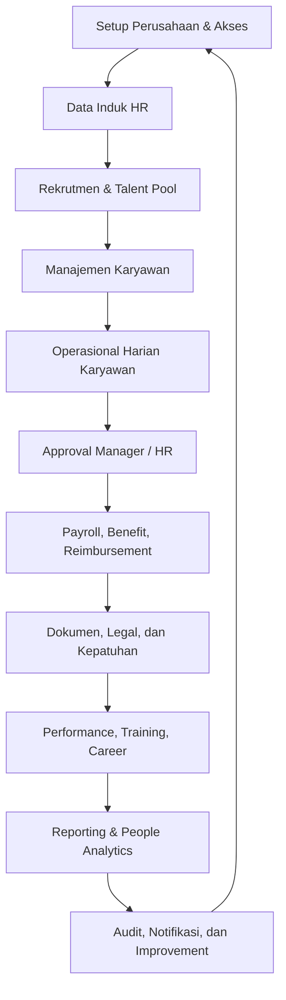

## Aktor Utama

| Aktor | Peran Bisnis |
|---|---|
| Super Admin | Mengatur sistem, role, permission, menu access, company setting, audit, dan konfigurasi global. |
| Admin / HR | Mengelola master data, data karyawan, cuti, absensi, payroll, reimbursement, asset, dokumen, training, KPI, dan compliance. |
| Manager | Meninjau dan menyetujui request bawahan seperti cuti, lembur, reimbursement, KPI, training, promosi, dan payroll tahap tertentu. |
| Employee | Menggunakan ESS untuk absensi, cuti, payroll pribadi, reimbursement, training, KPI, dokumen, asset, tugas, dan promosi. |
| Finance / Payroll Officer | Memproses payroll, pembayaran payroll, reimbursement paid, slip gaji, laporan pajak, dan komponen kompensasi. |

## 1. Setup Awal Sistem

Tujuan bisnis: sistem siap dipakai dengan struktur perusahaan, akses, dan aturan dasar yang benar.

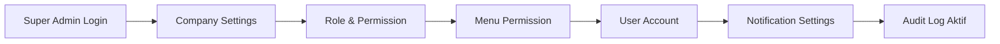

| Tahap | Modul / Halaman | Output |
|---|---|---|
| Konfigurasi perusahaan | `/settings/company` | Profil perusahaan dan preferensi dasar tersedia. |
| Konfigurasi akses | `/admin/roles`, `/admin/permissions`, `/admin/menu-permissions` | Role, permission, dan menu access tersusun. |
| Pengelolaan user | `/admin/users`, `/admin/users/assign-roles` | Akun user memiliki role yang sesuai. |
| Notifikasi | `/settings/notifications`, `/admin/notifications` | Channel notifikasi, email, dan broadcast siap digunakan. |
| Audit sistem | `/admin/audit-logs` | Aktivitas penting dapat ditelusuri. |

## 2. Setup Data Induk HR

Tujuan bisnis: seluruh referensi operasional HR tersedia sebelum employee dan transaksi dibuat.

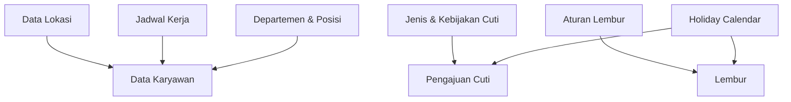

| Master Data | Halaman | Dipakai Oleh |
|---|---|---|
| Lokasi | `/locations` | Employee, attendance, work schedule. |
| Jadwal kerja | `/work-schedules` | Attendance, overtime, shift swap. |
| Departemen & posisi | `/organization/master-data` | Employee, org chart, reporting, KPI. |
| Jenis cuti | `/leave/type` | Leave request. |
| Kebijakan cuti | `/leave/policy` | Leave balance dan validasi cuti. |
| Kalender libur | `/workforce/holidays` | Attendance, leave, payroll. |
| Aturan lembur | `/workforce/overtime-rules` | Overtime request dan payroll input. |
| Perangkat biometrik | `/admin/biometric-devices`, `/biometric/devices` | Attendance capture. |

## 3. Rekrutmen sampai Employee Aktif

Tujuan bisnis: kebutuhan tenaga kerja berubah menjadi kandidat, kandidat masuk pipeline, lalu menjadi employee aktif.

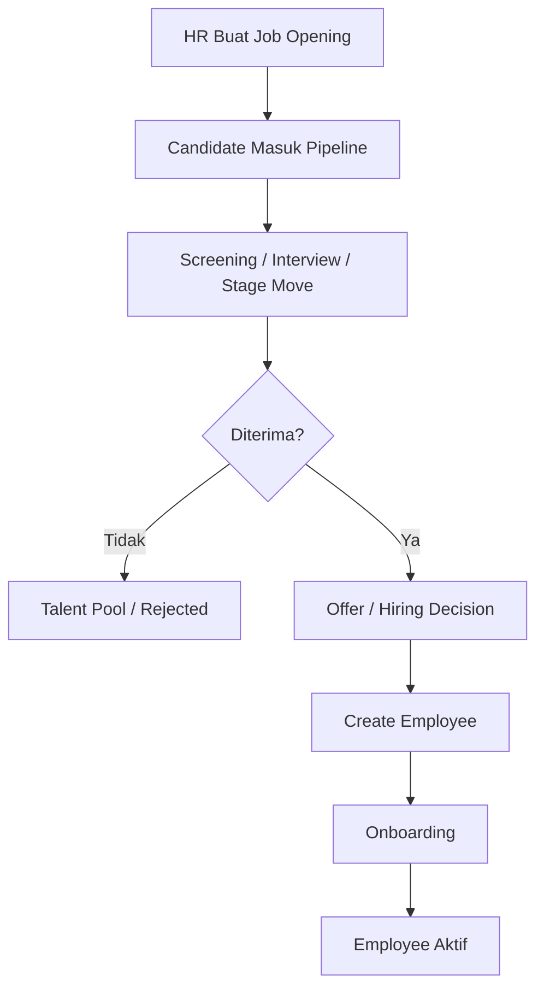

| Tahap | Role | Halaman | Output |
|---|---|---|---|
| Buat lowongan | HR / Admin | `/recruitment/openings` | Job opening aktif. |
| Kelola kandidat | HR / Admin | `/recruitment/candidates` | Kandidat masuk tahap pipeline. |
| Talent pool | HR / Admin | `/recruitment/talent-pool` | Kandidat potensial tersimpan. |
| Buat employee | HR / Admin | `/employees/add` | Data employee dibuat. |
| Lifecycle onboarding | HR / Admin | `/employees` | Employee seharusnya berpindah ke status aktif setelah onboarding. |

Catatan readiness: berdasarkan audit saat ini, create/update employee sudah tersedia, tetapi flow onboarding/offboarding belum tersambung penuh ke API lifecycle.

## 4. Operasional Harian Employee

Tujuan bisnis: employee menjalankan aktivitas harian, lalu data tersebut menjadi input approval, payroll, dan reporting.

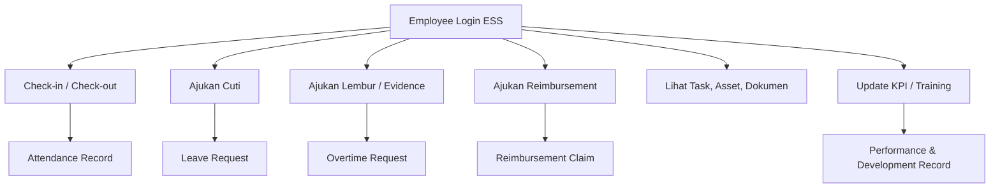

| Aktivitas Employee | Halaman ESS | Data yang Dihasilkan |
|---|---|---|
| Absensi masuk / pulang | `/attendance/check-in`, `/attendance/check-out` | Attendance record. |
| Riwayat absensi | `/attendance/history` | Rekap kehadiran pribadi. |
| Cuti | `/leave/request`, `/leave/my-leave`, `/leave/balance` | Leave request dan pemakaian saldo. |
| Lembur | `/my/overtime` | Overtime reason dan evidence. |
| Reimbursement | `/my/reimbursements` | Draft, submitted claim, attachment. |
| Payroll pribadi | `/my/payroll` | Slip gaji dan riwayat payroll. |
| Asset pribadi | `/my/assets` | Asset assignment dan return status. |
| Dokumen pribadi | `/my/documents`, `/my/assignment-letters` | Dokumen employee dan surat tugas. |
| KPI & kompetensi | `/my/kpi`, `/my/competencies` | Progress KPI dan kompetensi. |
| Training | `/my/trainings` | Enrollment dan status training. |
| Tugas | `/my/tasks` | Task pribadi dan status pekerjaan. |

## 5. Approval Center

Tujuan bisnis: transaksi employee dikontrol oleh manager, HR, admin, atau finance sebelum berdampak ke payroll, dokumen, atau data resmi.

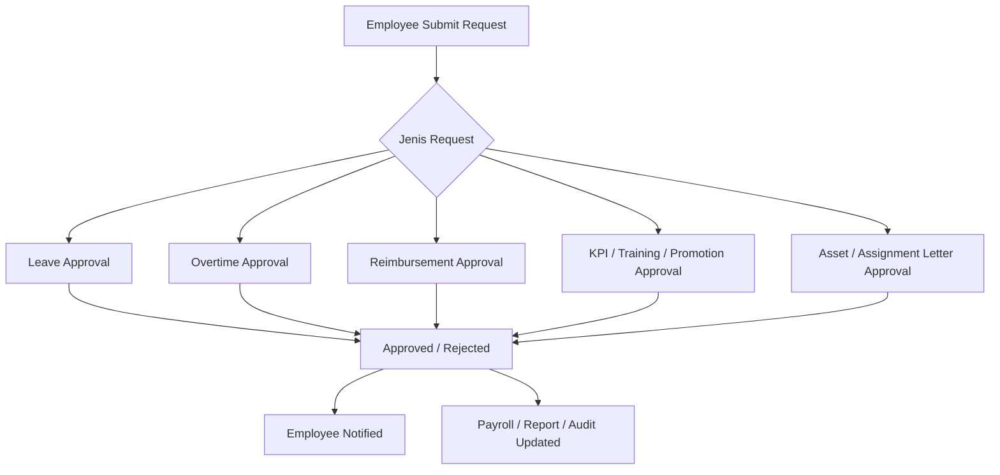

| Flow Approval | Pengaju | Approver | Halaman Utama | Dampak Setelah Approved |
|---|---|---|---|---|
| Cuti | Employee | Manager / HR | `/leave/approval` | Saldo dan kalender cuti berubah. |
| Lembur | Employee | Manager / HR | `/attendance/overtime` | Lembur dapat diproses sebagai input payroll. |
| Reimbursement | Employee | Manager / HR / Finance | `/reimbursements` | Claim masuk tahap paid bila disetujui dan dibayar. |
| Payroll | HR / Payroll | Manager lalu HR / Finance | `/payroll/process` | Payroll dapat dibayar dan slip dapat dilihat employee. |
| KPI | Employee / Manager / HR | Manager / HR | `/kpis`, `/my/kpi` | Target dan progress kinerja menjadi resmi. |
| Training | Employee / HR | Manager / HR | `/training/programs`, `/my/trainings` | Enrollment dan completion tercatat. |
| Asset | HR / Admin | HR / Admin / Employee return flow | `/assets`, `/my/assets` | Asset assignment/return tercatat. |
| Promosi | Manager / HR | HR / Management | `/promotions`, `/my/promotions` | Perubahan karier dapat diproses. |

## 6. Payroll, Benefit, dan Pembayaran

Tujuan bisnis: data employee, attendance, overtime, benefit, pajak, dan approval dikonsolidasikan menjadi payroll yang valid.

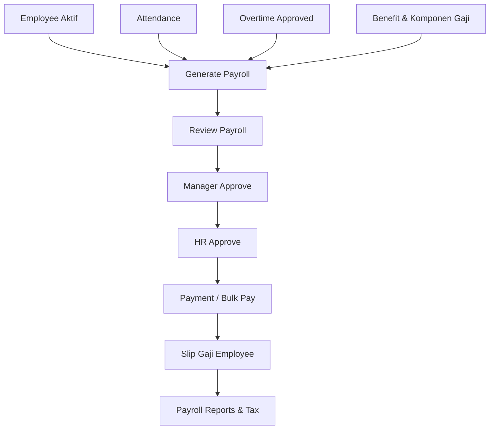

| Tahap | Role | Halaman | Output |
|---|---|---|---|
| Komponen gaji | HR / Payroll | `/payroll/component`, `/enterprise/compensation` | Komponen payroll tersusun. |
| Benefit | HR / Admin | `/compensation/benefits` | Benefit karyawan terdaftar. |
| Generate / run payroll | HR / Payroll | `/payroll/run`, `/payroll/process` | Payroll draft. |
| Approval manager | Manager | `/payroll/process` | Status naik ke tahap HR. |
| Approval HR | HR | `/payroll/process` | Payroll approved. |
| Payment | HR / Finance | `/payroll/process` | Payroll paid. |
| Slip gaji | Employee | `/my/payroll` | Employee melihat slip gaji. |
| Laporan payroll | HR / Finance | `/payroll/reports` | Rekap payroll dan pajak. |

Catatan readiness: flow inti payroll sudah ada dari generate sampai paid, tetapi boundary akses frontend perlu diperjelas agar halaman payroll sensitif tidak hanya bergantung pada authenticated route umum.

## 7. Dokumen, Legal, dan Kepatuhan

Tujuan bisnis: keputusan HR dan transaksi employee terdokumentasi serta selaras dengan kebijakan perusahaan.

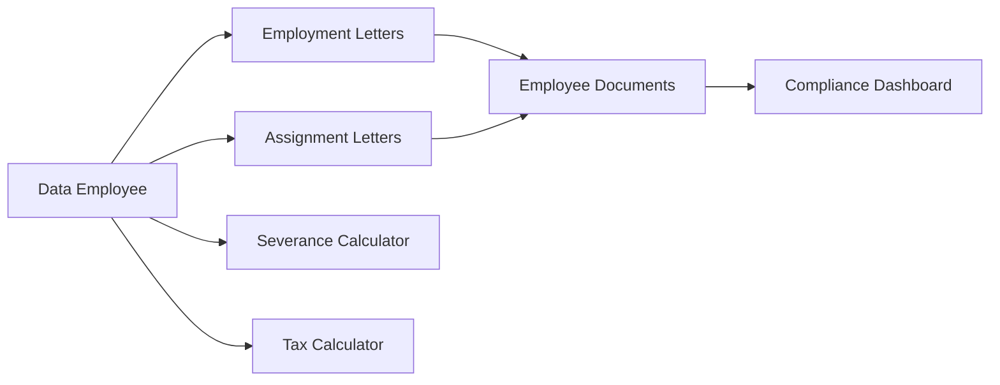

| Area | Halaman | Output |
|---|---|---|
| Surat kerja | `/legal/letters` | Dokumen employment letter. |
| Surat tugas | `/admin/assignment-letters`, `/my/assignment-letters` | Surat tugas untuk employee. |
| Pesangon | `/legal/severance` | Estimasi severance. |
| Pajak progresif | `/legal/tax` | Perhitungan pajak. |
| Kepatuhan | `/compliance/overview`, `/compliance/settings` | Status compliance dan setting kebijakan. |

## 8. Performance, Training, dan Career Development

Tujuan bisnis: perusahaan mengelola target kinerja, kompetensi, pelatihan, promosi, succession, dan IDP.

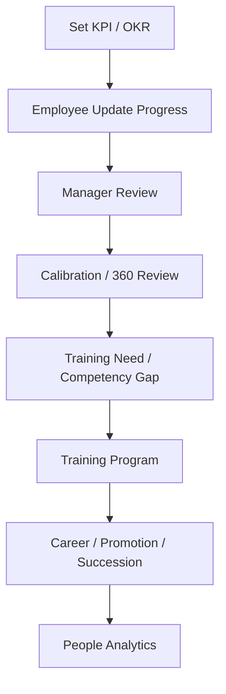

| Flow | Halaman | Output |
|---|---|---|
| KPI / OKR | `/kpis`, `/my/kpi`, `/performance/okrs` | Target, progress, approval, dan evaluasi. |
| Review 360 | `/performance/reviews` | Feedback multi sumber. |
| Calibration | `/performance/calibration` | Kalibrasi performa. |
| Training | `/training/programs`, `/my/trainings` | Program, enrollment, completion. |
| Kompetensi | `/competencies`, `/my/competencies` | Matrix kompetensi dan assessment. |
| Promosi | `/promotions`, `/my/promotions` | Proposal dan status promosi. |
| Succession / IDP | `/career/succession`, `/career/idps` | Rencana suksesi dan pengembangan individu. |

## 9. Reporting, Analytics, dan Continuous Improvement

Tujuan bisnis: data operasional HR diubah menjadi insight untuk keputusan manajemen.

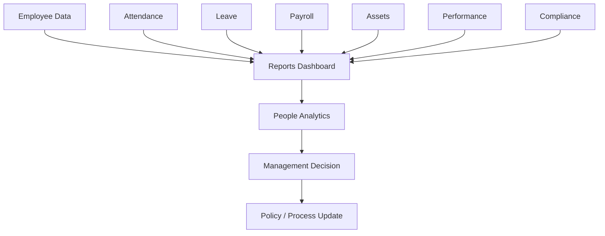

| Laporan | Halaman | Tujuan |
|---|---|---|
| Dashboard laporan | `/reports/dashboard-summary` | Ringkasan lintas modul. |
| People analytics | `/analytics/people-detailed` | Analisis data karyawan lebih detail. |
| Attendance reports | `/attendance/reports` | Rekap kehadiran dan absensi. |
| Payroll reports | `/payroll/reports` | Rekap payroll, pajak, dan pembayaran. |
| Compliance dashboard | `/compliance/overview` | Monitoring kepatuhan. |

## End-to-End Flow per Role

### Employee

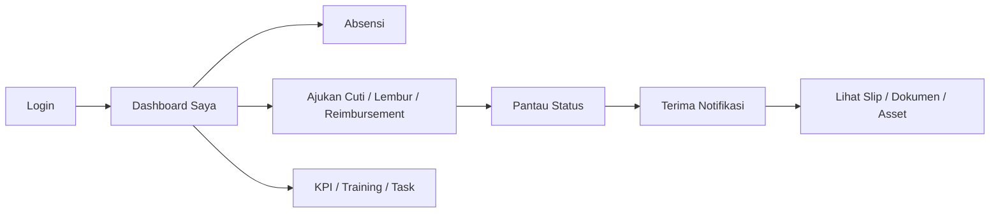

Ringkasnya: employee memakai ESS untuk transaksi pribadi, menunggu approval, menerima notifikasi, lalu melihat hasil akhir seperti status cuti, pembayaran, slip gaji, dokumen, training, asset, dan tugas.

### Manager

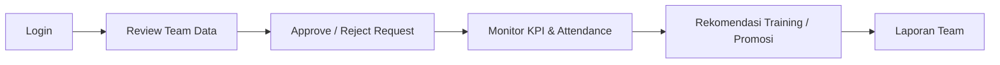

Ringkasnya: manager menjadi titik kontrol atas transaksi bawahan, terutama approval, performance, dan rekomendasi pengembangan.

### HR / Admin

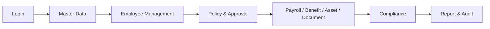

Ringkasnya: HR/Admin mengelola fondasi data, menjalankan proses HR, memastikan transaksi selesai, dan menjaga kepatuhan.

### Super Admin

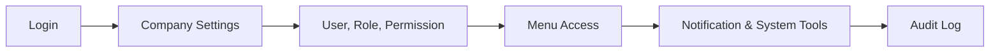

Ringkasnya: super admin menjaga sistem tetap terkendali dari sisi akses, konfigurasi, notifikasi, dan audit.

## Status Kesiapan Flow Saat Ini

| Flow | Status Bisnis | Catatan |
|---|---|---|
| Auth dan dashboard | Tersedia | Login, register, reset password, Google callback, dan dashboard sudah dipetakan. |
| Master data | Tersedia | Lokasi, jadwal kerja, leave type/policy, holiday, overtime rule, dan organization master tersedia. |
| Employee create/update | Tersedia | Create/update berjalan, lifecycle onboarding/offboarding belum utuh. |
| Leave | Hampir utuh | Submit, balance, approval, calendar tersedia. Perlu hardening akses frontend. |
| Attendance | Tersedia | Check-in, check-out, history, today, reports tersedia. |
| Overtime | Belum utuh | Ada gap endpoint `POST /my/overtime` berdasarkan audit sebelumnya. |
| Payroll | Tersedia dengan catatan | Generate, approve manager, approve HR, pay, slip tersedia. Akses frontend perlu diperjelas. |
| Reimbursement | Hampir utuh | Draft, submit, approve/reject tersedia. Tahap mark paid perlu dipastikan terlihat di UI final. |
| Asset | Tersedia dengan approval | CRUD, assign, return, ESS asset tersedia. |
| KPI / performance | Tersedia | KPI, OKR, review, calibration tersedia, perlu QA per role. |
| Training / competency | Tersedia | Program, enrollment, competency matrix, ESS training tersedia. |
| Legal / document | Tersedia | Surat tugas, surat kerja, pajak, pesangon, dokumen employee tersedia. |
| Reporting | Tersedia dengan catatan | Beberapa laporan dedicated diarahkan ke dashboard summary; beberapa statistik perlu validasi total dataset. |
| Admin / RBAC | Kritis dan tersedia | Role, permission, menu access, users, audit log tersedia. |

## Prioritas End-to-End Sebelum Production

1. Pastikan role dan menu guard selaras untuk modul sensitif: payroll, leave approval, reimbursement, employee lifecycle, asset, benefit, promotion, legal, dan reporting.
2. Selesaikan gap overtime request creation: tambahkan endpoint backend yang sesuai atau ubah frontend agar mengikuti endpoint yang benar.
3. Sambungkan employee lifecycle onboarding/offboarding ke API nyata dan pastikan aksi tersedia dari tabel employee.
4. Pastikan reimbursement memiliki tahap akhir operasional yang jelas sampai paid.
5. Validasi payroll dengan akun berbeda: HR, manager, finance, employee.
6. Uji semua approval dengan skenario approve, reject, alasan reject, history, notifikasi, dan direct URL access.
7. Audit ulang statistik dashboard/list agar tidak hanya menghitung data page aktif.

## Kesimpulan

Secara end-to-end, HRIS ini sudah memiliki kerangka bisnis lengkap:

```text
setup sistem -> master data -> recruitment -> employee management -> ESS transaction
-> approval -> payroll/payment/document -> reporting -> audit/improvement
```

Flow yang paling siap untuk diuji lanjut adalah leave, reimbursement, payroll, master data, dan ESS dasar. Flow yang perlu diprioritaskan sebelum production adalah overtime request creation, employee lifecycle, role guard untuk modul sensitif, dan validasi statistik/reporting pada data besar.
