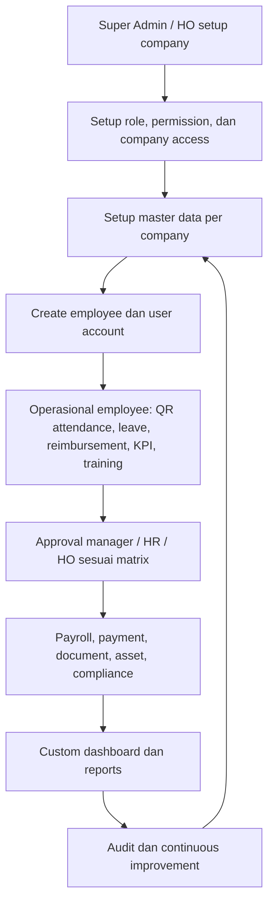
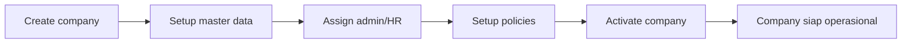
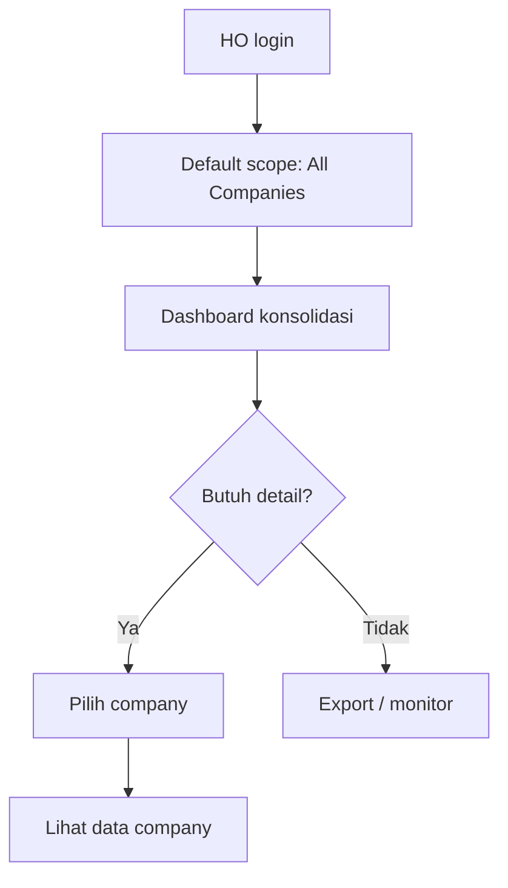
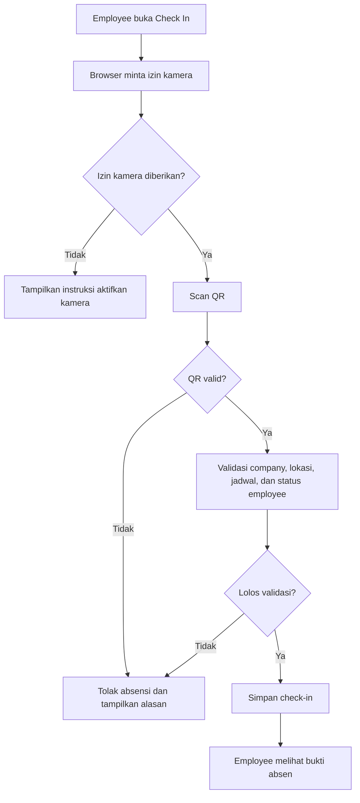
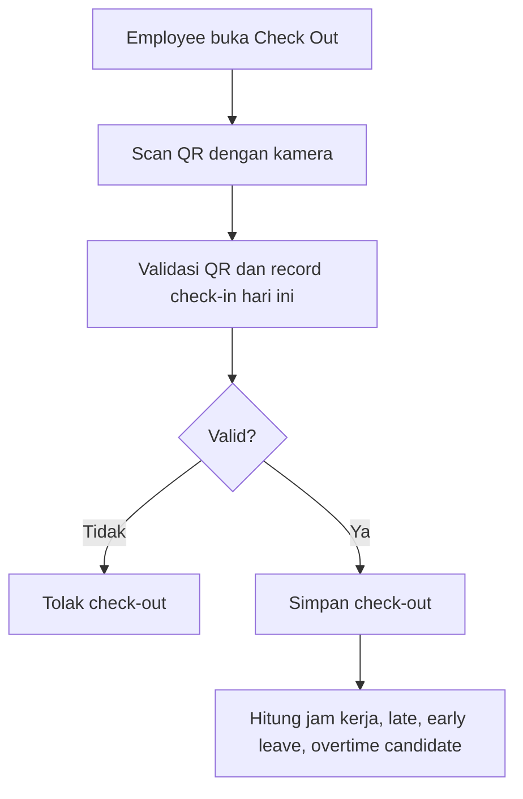
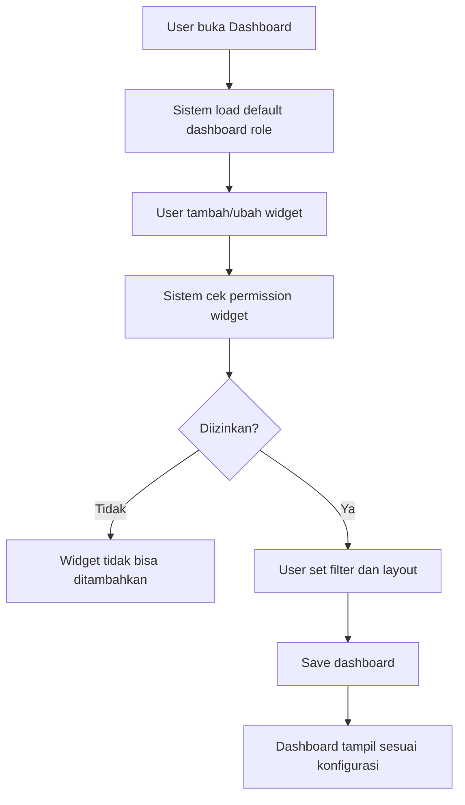

# Business Process HRIS - Penambahan Multi Company, HO, QR Attendance, dan Custom Dashboard

Dokumen ini menjelaskan proses bisnis HRIS end-to-end dengan penambahan:

- Bisa create dan kelola company.
- Role HO atau Head Office bisa melihat seluruh company.
- Absensi wajib scan QR code memakai kamera.
- Dashboard bisa dikustomisasi sesuai role, company, dan kebutuhan user.

Dokumen ini memakai sudut pandang bisnis, sehingga dapat dipakai untuk diskusi PM, BA, QA, backend, frontend, dan stakeholder operasional.

## 1. Prinsip Bisnis Baru

### 1.1 Multi Company

Sistem tidak lagi hanya membaca satu perusahaan. Semua data operasional utama harus memiliki konteks `company_id`, seperti employee, location, schedule, attendance, leave, payroll, reimbursement, asset, KPI, training, document, report, dan dashboard.

| Role | Cakupan data |
|---|---|
| Super Admin | Semua company, konfigurasi global, dan konfigurasi tenant. |
| HO / Head Office | Semua company untuk monitoring, approval tertentu, reporting konsolidasi, dan audit. |
| Company Admin / HR | Hanya company yang ditugaskan. |
| Manager | Company sendiri dan tim/bawahan yang berada di bawah struktur organisasinya. |
| Employee | Data pribadi di company tempat employee terdaftar. |

Aturan utama: user non-HO tidak boleh melihat, membuat, mengubah, approve, atau export data company lain.

### 1.2 Company Scope

Setiap halaman operasional perlu menentukan scope data:

| Scope | Penggunaan |
|---|---|
| Single company | Default untuk admin/HR/manager/employee company tertentu. |
| Multi company | Untuk HO dan Super Admin. |
| Consolidated | Untuk dashboard dan laporan lintas company. |
| Drill-down | HO melihat ringkasan semua company, lalu masuk ke detail satu company. |

### 1.3 QR Attendance

Absensi tidak cukup klik tombol check-in/check-out. Employee wajib:

1. Membuka halaman absensi.
2. Mengizinkan akses kamera.
3. Scan QR code valid.
4. Sistem validasi QR, lokasi, jadwal, employee, dan periode waktu.
5. Sistem menyimpan attendance record.

### 1.4 Custom Dashboard

Dashboard perlu bisa dikustomisasi berdasarkan:

- Role: HO, admin, HR, manager, employee.
- Company scope: semua company atau satu company.
- Widget: attendance, leave, payroll, headcount, reimbursement, KPI, training, compliance, asset.
- Filter default: company, department, location, periode, employment status.
- Permission: user hanya bisa menambah widget yang datanya memang boleh diakses.

## 2. End-to-End Besar



Output akhir dari flow ini adalah data HR yang rapi per company, bisa dikonsolidasikan oleh HO, dan tetap aman untuk user yang hanya punya akses ke company tertentu.

## 3. Business Process per Fitur

### 3.1 Company Management

Tujuan: membuat dan mengelola perusahaan/cabang/legal entity di dalam HRIS.

| Tahap | Aktor | Proses | Output |
|---|---|---|---|
| Create company | Super Admin / HO | Isi nama company, kode, legal name, alamat, NPWP, status, timezone, currency, dan konfigurasi dasar. | Company baru aktif atau draft. |
| Setup struktur | Super Admin / HO / Company Admin | Buat department, position, location, work schedule, holiday calendar. | Master data company siap. |
| Assign admin | Super Admin / HO | Tentukan admin/HR untuk company tersebut. | Admin company bisa mengelola data internal. |
| Setup policy | Company Admin / HR | Setup leave policy, overtime rule, payroll component, approval flow. | Aturan operasional per company aktif. |
| Monitoring | HO / Super Admin | Melihat status setup dan data readiness per company. | HO tahu company mana yang siap dipakai. |

Flow:



Validasi penting:

- Kode company harus unik.
- Company tidak boleh dihapus jika sudah memiliki transaksi aktif.
- Deaktivasi company harus menghentikan transaksi baru tanpa menghapus histori.
- Semua create employee harus memilih company.

### 3.2 HO Multi-Company Access

Tujuan: HO bisa melihat seluruh company tanpa mencampur ownership data.

| Tahap | Aktor | Proses | Output |
|---|---|---|---|
| Login | HO | Masuk sistem dengan role HO. | Sistem membaca daftar company yang boleh diakses. |
| Pilih scope | HO | Pilih "All Companies" atau satu company tertentu. | Filter company aktif. |
| Monitor dashboard | HO | Melihat headcount, attendance, leave, payroll, KPI, dan compliance lintas company. | Ringkasan konsolidasi. |
| Drill-down | HO | Klik company tertentu untuk detail. | Data detail company tampil. |
| Export report | HO | Export laporan konsolidasi atau per company. | File report sesuai scope. |

Flow:



Aturan akses:

- HO boleh view seluruh company.
- Aksi create/update/delete sebaiknya dibatasi berdasarkan permission tambahan.
- Approval lintas company hanya boleh jika approval flow menunjuk HO sebagai approver.
- Semua report HO harus menampilkan informasi company agar tidak ambigu.

### 3.3 Employee Management

Tujuan: HR membuat dan memelihara data karyawan dalam company yang benar.

| Tahap | Aktor | Proses | Output |
|---|---|---|---|
| Create employee | HR / Company Admin / HO | Isi data pribadi, employment, company, department, position, manager, location, schedule. | Employee draft/active. |
| Link user account | HR / Admin | Buat atau hubungkan akun login employee. | Employee bisa login ESS. |
| Onboarding | HR | Jalankan checklist onboarding, dokumen, asset, training awal. | Employee siap bekerja. |
| Update data | HR | Perubahan posisi, manager, lokasi, schedule, status kerja. | Histori employee terjaga. |
| Offboarding | HR | Proses resign/termination, return asset, dokumen akhir. | Employee nonaktif dengan catatan lengkap. |

Penambahan multi-company:

- Field company wajib saat create employee.
- Department, position, location, schedule harus difilter berdasarkan company.
- HO bisa membuat employee untuk company mana pun jika diberi permission.
- HR company hanya bisa membuat employee untuk company sendiri.

### 3.4 QR Code Attendance dengan Kamera

Tujuan: absensi lebih aman karena employee harus scan QR valid memakai kamera.

| Tahap | Aktor | Proses | Output |
|---|---|---|---|
| Generate QR | HR / Admin sistem | Sistem menampilkan QR attendance untuk company/location/shift/periode tertentu. | QR aktif dengan expiry. |
| Buka absensi | Employee | Employee buka check-in/check-out. | Kamera diminta aktif. |
| Scan QR | Employee | Kamera membaca QR. | Payload QR terbaca. |
| Validasi | Sistem | Cek QR signature, expiry, company, location, employee schedule, duplicate attendance, dan status employee. | Valid atau ditolak. |
| Simpan attendance | Sistem | Create check-in/check-out record. | Attendance record resmi. |
| Monitoring | Manager / HR / HO | Lihat status hadir, terlambat, belum absen, atau invalid attempt. | Rekap attendance real-time. |

Flow check-in:



Flow check-out:



Business rules QR:

- QR harus memiliki masa berlaku, misalnya 30-120 detik untuk QR dinamis.
- QR wajib ditandatangani server agar tidak mudah dipalsukan.
- QR terkait company dan lokasi.
- Employee hanya bisa absen pada company tempat ia terdaftar.
- Jika HO scan QR, sistem tetap memakai employee profile milik user tersebut, bukan scope HO.
- Invalid attempt perlu masuk audit/security log.
- Fallback manual attendance hanya boleh dilakukan HR/Admin dengan alasan dan audit trail.

### 3.5 Attendance Admin dan Reports

Tujuan: HR, manager, dan HO memantau kehadiran.

| Aktor | Scope | Proses |
|---|---|---|
| Manager | Tim sendiri | Melihat kehadiran bawahan, keterlambatan, absen, dan overtime candidate. |
| HR Company | Company sendiri | Melihat seluruh attendance company dan koreksi manual bila diizinkan. |
| HO | Semua company | Monitoring attendance lintas company, drill-down per company/location. |
| Employee | Pribadi | Melihat riwayat check-in/check-out sendiri. |

Penambahan report:

- Report attendance harus bisa filter company.
- HO melihat summary per company: present, absent, late, leave, overtime.
- Export attendance harus mencantumkan company dan location.

### 3.6 Leave

Tujuan: employee mengajukan cuti, approver menilai, saldo cuti terupdate.

| Tahap | Aktor | Proses | Output |
|---|---|---|---|
| Setup policy | HR Company / HO | Buat leave type dan leave policy per company. | Policy aktif. |
| Submit leave | Employee | Pilih tanggal, tipe cuti, alasan, attachment bila perlu. | Leave request submitted. |
| Validate | Sistem | Cek saldo, overlap, holiday, jadwal kerja, company policy. | Request valid/invalid. |
| Approve/reject | Manager / HR / HO | Approval sesuai flow company. | Status final atau lanjut approval berikutnya. |
| Update saldo | Sistem | Kurangi saldo bila approved. | Leave balance berubah. |
| Report | HR / HO | Rekap cuti per company/departemen. | Insight absensi dan manpower. |

Penambahan multi-company:

- Policy cuti per company.
- HO bisa melihat cuti semua company.
- Manager hanya approve bawahan sesuai struktur.

### 3.7 Overtime

Tujuan: lembur diajukan, divalidasi, disetujui, lalu menjadi input payroll.

| Tahap | Aktor | Proses | Output |
|---|---|---|---|
| Setup rule | HR Company | Buat aturan lembur per company dan schedule. | Overtime rule aktif. |
| Candidate overtime | Sistem | Dari attendance check-out, sistem menghitung potensi lembur. | Overtime candidate. |
| Submit reason/evidence | Employee | Isi alasan dan upload bukti. | Overtime request submitted. |
| Approval | Manager / HR / HO | Approve/reject request dan evidence. | Overtime approved/rejected. |
| Payroll input | Sistem / Payroll | Approved overtime masuk payroll. | Komponen lembur dihitung. |

QR attendance membantu overtime karena jam aktual berasal dari check-in/check-out yang tervalidasi.

### 3.8 Payroll

Tujuan: payroll dihitung dari data employee, attendance, leave, overtime, benefit, reimbursement, dan pajak.

| Tahap | Aktor | Proses | Output |
|---|---|---|---|
| Setup komponen | HR / Payroll Company | Gaji pokok, allowance, deduction, benefit, pajak. | Payroll component aktif. |
| Generate payroll | Payroll / HR | Pilih company dan periode. | Draft payroll. |
| Review | Payroll / HR | Cek attendance, overtime, reimbursement, deduction. | Draft siap approval. |
| Approval tahap 1 | Manager / Finance / sesuai policy | Approve/reject payroll. | Status naik tahap berikutnya. |
| Approval tahap 2 | HR / HO / Finance | Final approval. | Payroll approved. |
| Payment | Finance / Payroll | Bayar payroll. | Payroll paid. |
| Payslip | Employee | Employee melihat slip sendiri. | Slip tersedia. |
| Consolidated report | HO | Melihat payroll cost semua company. | Laporan konsolidasi. |

Penambahan multi-company:

- Payroll harus digenerate per company dan periode.
- HO bisa melihat consolidated payroll, tetapi detail sensitif tetap mengikuti permission.
- Employee hanya melihat payroll miliknya.

### 3.9 Reimbursement

Tujuan: claim biaya diajukan, diverifikasi, disetujui, dan dibayar.

| Tahap | Aktor | Proses | Output |
|---|---|---|---|
| Setup category | HR / Finance | Kategori biaya per company. | Expense category aktif. |
| Create draft | Employee | Isi tanggal, kategori, nominal, bukti. | Draft reimbursement. |
| Submit | Employee | Kirim klaim. | Status submitted. |
| Review | Manager / HR / Finance | Cek bukti dan kesesuaian policy. | Approve/reject. |
| Mark paid | Finance | Tandai sudah dibayar. | Status paid. |
| Report | HR / HO | Rekap reimbursement per company dan kategori. | Analisis biaya. |

### 3.10 KPI, Performance, Training, dan Competency

Tujuan: target, performa, kompetensi, dan pengembangan employee dikelola per company.

| Fitur | Proses bisnis |
|---|---|
| KPI / OKR | HR/manager membuat target, employee update progress, manager review, HR/HO melihat summary. |
| Calibration | HR mengatur periode kalibrasi, manager memberi penilaian, HR finalisasi. |
| Training | HR membuat program, employee/manager mendaftarkan, approval bila perlu, completion dicatat. |
| Competency | HR membuat matrix, manager/assessor menilai, gap menjadi input training. |

Penambahan HO:

- HO melihat talent, KPI, training, dan competency summary semua company.
- Data detail employee tetap mengikuti permission.
- Benchmark antar company harus memakai definisi KPI yang seragam.

### 3.11 Asset dan Dokumen

Tujuan: aset dan dokumen employee tercatat rapi.

| Fitur | Proses bisnis |
|---|---|
| Asset | HR/Admin membuat inventory per company, assign ke employee, employee menerima/mengembalikan, HR approve return. |
| Document | Employee upload dokumen, HR review, sistem menyimpan expiry dan status compliance. |
| Assignment letter | HR/manager membuat surat tugas, approval bila perlu, employee melihat dokumen. |
| Employment letter | HR generate surat kerja berdasarkan template company. |

Penambahan multi-company:

- Template dokumen bisa global atau per company.
- Asset inventory wajib terkait company/location.
- HO bisa monitoring expiry dan asset exposure lintas company.

### 3.12 Custom Dashboard

Tujuan: user melihat data yang paling relevan tanpa membuka banyak halaman.

| Tahap | Aktor | Proses | Output |
|---|---|---|---|
| Pilih layout | User | Pilih template dashboard sesuai role. | Layout awal terbentuk. |
| Tambah widget | User | Pilih widget yang diizinkan permission. | Widget tampil. |
| Atur filter | User | Pilih company, department, location, periode. | Dashboard personal. |
| Simpan | User | Save sebagai dashboard pribadi atau role dashboard. | Konfigurasi tersimpan. |
| Share/default | Admin / HO | Jadikan default untuk role/company tertentu. | Standard dashboard organisasi. |

Widget minimal:

| Role | Widget utama |
|---|---|
| HO | Headcount per company, attendance today, payroll cost, leave trend, reimbursement cost, KPI summary, compliance risk. |
| HR Company | Employee status, attendance, leave, onboarding/offboarding, expiring documents, training, open approvals. |
| Manager | Team attendance, pending approval, team KPI, leave calendar, overtime. |
| Employee | Attendance today, leave balance, payslip, pending request, KPI progress, training. |

Flow custom dashboard:



Business rules dashboard:

- Widget mengikuti permission dan company access.
- HO boleh memilih "All Companies".
- Company user tidak boleh melihat opsi company lain.
- Dashboard default role bisa dikunci oleh admin jika perlu.
- Export dari widget harus mengikuti filter dashboard.

## 4. End-to-End per Role

### 4.1 Super Admin

```text
Login -> create company -> assign HO/company admin -> setup global permission
-> monitor audit -> handle cross-company configuration -> review consolidated reports
```

Fokus Super Admin adalah konfigurasi global, keamanan akses, dan kontrol sistem.

### 4.2 HO / Head Office

```text
Login -> lihat dashboard all companies -> drill-down company
-> monitor attendance/leave/payroll/performance/compliance
-> approve bila masuk approval flow -> export consolidated report
```

Fokus HO adalah visibilitas lintas company dan keputusan manajemen berbasis data konsolidasi.

### 4.3 Company Admin / HR

```text
Login -> kelola master data company -> create employee
-> setup policy -> monitor QR attendance -> proses approval
-> payroll/reimbursement/document/asset -> report company
```

Fokus HR/Admin adalah memastikan company sendiri berjalan end-to-end.

### 4.4 Manager

```text
Login -> lihat dashboard team -> monitor attendance team
-> approve leave/overtime/reimbursement/KPI/training
-> review performance -> lihat report team
```

Fokus manager adalah kontrol operasional tim.

### 4.5 Employee

```text
Login -> buka employee dashboard -> scan QR check-in
-> ajukan leave/overtime/reimbursement bila perlu
-> scan QR check-out -> pantau status approval
-> lihat payslip, KPI, training, dokumen, asset
```

Fokus employee adalah self-service pribadi.

## 5. End-to-End Skenario Utama

### 5.1 Company Baru sampai Siap Operasional

```text
Super Admin/HO create company
-> assign company admin/HR
-> setup department, position, location, schedule
-> setup leave policy, overtime rule, payroll component
-> setup QR attendance location
-> create employee dan user
-> employee bisa login ESS
-> company aktif di dashboard HO
```

Acceptance criteria:

- Company muncul di daftar company HO.
- Company admin hanya melihat company tersebut.
- Employee hanya muncul di company yang benar.
- QR attendance company sudah bisa dipakai.
- Dashboard company menampilkan data awal.

### 5.2 Employee Absen Pakai QR

```text
Employee login
-> buka check-in
-> kamera aktif
-> scan QR lokasi/company
-> sistem validasi QR, employee, jadwal, lokasi
-> attendance check-in tersimpan
-> manager/HR/HO melihat status hadir
-> employee scan QR check-out
-> sistem hitung jam kerja dan potensi lembur
```

Acceptance criteria:

- QR expired tidak bisa dipakai.
- QR company lain ditolak.
- Kamera tidak aktif menampilkan instruksi.
- Duplicate check-in/check-out ditolak.
- Attendance record masuk report sesuai company.

### 5.3 HO Monitoring Semua Company

```text
HO login
-> dashboard default All Companies
-> lihat summary headcount, attendance, payroll, leave, KPI
-> filter periode
-> drill-down company bermasalah
-> export report konsolidasi
```

Acceptance criteria:

- HO melihat semua company.
- Company admin tidak melihat All Companies.
- Angka konsolidasi sama dengan total per company.
- Export mengikuti filter.

### 5.4 Payroll dari Attendance QR

```text
Employee absen QR selama periode payroll
-> overtime/leave/reimbursement approved
-> payroll generate per company
-> payroll review
-> approval sesuai flow
-> payment
-> employee melihat payslip
-> HO melihat payroll cost konsolidasi
```

Acceptance criteria:

- Attendance valid menjadi input payroll.
- Leave approved mempengaruhi payroll sesuai policy.
- Overtime approved masuk komponen payroll.
- Payroll company lain tidak terlihat oleh admin company biasa.
- Payslip hanya milik employee terkait.

### 5.5 Custom Dashboard

```text
User login
-> sistem load dashboard role
-> user pilih widget
-> sistem cek permission dan company access
-> user atur layout/filter
-> save dashboard
-> dashboard tampil konsisten saat login berikutnya
```

Acceptance criteria:

- User tidak bisa menambah widget tanpa permission.
- HO bisa membuat dashboard All Companies.
- Employee hanya bisa membuat dashboard data pribadi.
- Dashboard tersimpan per user.
- Admin bisa membuat default dashboard per role/company bila diberi permission.

## 6. Data dan Permission yang Perlu Ditambahkan

### 6.1 Data Model Minimum

| Entity | Field penting |
|---|---|
| Company | id, code, name, legal_name, address, status, timezone, currency, parent_company_id. |
| User Company Access | user_id, company_id, role_scope, is_default. |
| Employee | company_id, department_id, position_id, location_id, manager_id, work_schedule_id. |
| QR Attendance Token | company_id, location_id, shift_id, token_hash, expires_at, status, generated_by. |
| Attendance | company_id, employee_id, location_id, qr_token_id, check_in_at, check_out_at, validation_status. |
| Dashboard Config | user_id, role_id, company_scope, layout_json, filters_json, is_default. |
| Dashboard Widget | widget_key, required_permission, allowed_roles, data_scope. |

### 6.2 Permission Minimum

| Permission | Tujuan |
|---|---|
| company.view | Melihat company. |
| company.create | Membuat company. |
| company.update | Mengubah company. |
| company.deactivate | Menonaktifkan company. |
| company.view_all | Melihat semua company, khusus HO/Super Admin. |
| company.assign_user | Assign admin/HR/user ke company. |
| attendance.qr.generate | Generate QR attendance. |
| attendance.qr.scan | Scan QR untuk absensi pribadi. |
| attendance.manual_adjust | Koreksi absensi manual. |
| dashboard.customize_self | Custom dashboard pribadi. |
| dashboard.manage_default | Mengatur dashboard default role/company. |
| dashboard.view_all_company | Widget konsolidasi semua company. |

## 7. QA End-to-End Checklist

| Area | Test utama |
|---|---|
| Company | Create, update, deactivate, assign admin, data isolation antar company. |
| HO | All Companies visible, drill-down, export consolidated, tidak bocor ke role lain. |
| Employee | Create employee wajib company, dropdown master data sesuai company. |
| QR Attendance | Kamera, QR valid, QR expired, QR company lain, duplicate scan, check-in/check-out. |
| Leave | Policy per company, approval per manager/company, report HO. |
| Payroll | Generate per company, approval, payment, payslip employee, consolidated report HO. |
| Reimbursement | Submit, approve, mark paid, filter company, report HO. |
| Dashboard | Tambah widget, permission widget, save layout, All Companies hanya HO. |
| Security | Direct URL access, API company scope, audit log invalid attempt. |

## 8. Prioritas Implementasi

1. Tambahkan entity dan API company management.
2. Tambahkan company scope pada user, employee, dan semua query list/report.
3. Tambahkan role HO dengan permission `company.view_all`.
4. Perketat frontend route/menu berdasarkan permission dan company scope.
5. Implement QR attendance: generate QR, scan kamera, validasi, audit invalid attempt.
6. Implement custom dashboard: config, widget registry, permission widget, save layout.
7. QA end-to-end per role dan per company.

## 9. Kesimpulan

Dengan penambahan ini, end-to-end HRIS berubah menjadi:

```text
create company -> setup company access -> setup master data per company
-> create employee -> QR attendance dan ESS transaction
-> approval -> payroll/payment/document/asset
-> custom dashboard -> HO consolidated reporting -> audit/improvement
```

Perubahan paling penting bukan hanya menambah halaman, tetapi memastikan seluruh data dan permission mempunyai company scope yang konsisten. HO menjadi role lintas company, sementara HR/admin/manager/employee tetap dibatasi sesuai company dan struktur organisasinya.
